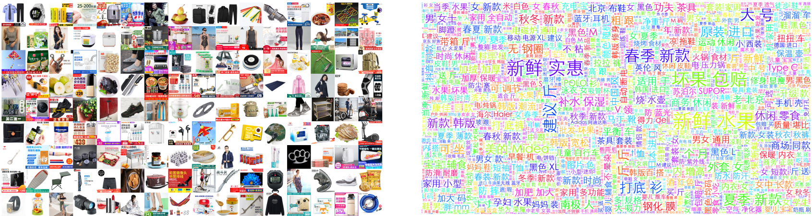

# MEP-3M: A Large-scale Multi-modal E-Commerce Products Dataset

In IJCAI 2021 Workshop on Long-Tailed Distribution Learning (LTDL), https://ltdl-ijcai21.github.io/, **Best dataset paper award.**

The MEP-3M consists of over **3 million** products and **599** fine-grained product categories. Each product is represented with an image-text pair and annotated with hierarchical labels. The data is collected from several Chinese online shopping websites. The text is in Chinese.

## Key Features

- **Large-scale.** MEP-3M dataset consists of over 3 million product samples in total. Each sample consists of an image-text pair, resulting in 3,012,959 images and 156,069,329 characters. The entire dataset takes approximately 76GB of storage.  
- **Hierarchical-categorized.** Three levels of the label are given. There are 14 classes (first level), 599 sub-classes (second level), and 13 sub-classes have further subsub-classes (third level).
- **Multi-modal.** Each product has both image and Chinese label and title. 
- **Fine-grained.** There are a total of 599 sub-classes, and many of them are fine-grained (e.g., different types of fruit, meat, shoes, clothes, etc.).
- **Long-tailed.** MEP-3M is highly imbalanced. Some sub-classes in the dataset have more than 90k samples, while some classes have around 30 samples. 

## Download

### MEP-3M-tiny

A tiny subset of MEP-3M, following exactly the same organization. It consists only 6 of 599 sub-classes.

File size: 25.79MB.

Download: [BaiduPan](https://pan.baidu.com/s/1Ho39TCU38pRuvdLiTiwCzg ) (Extraction code: MEP3)

### MEP-3M

If you want to have an access to the full dataset, please contact fanliu@hhu.edu.cn for an download link

## Dataset organization

See [dataset_info.xlsx](dataset_info.xlsx) 

| class_id | class_name          | sub_class_id↑ | sub_class_name | subsub_class_id | subsub_class_name |
| -------- | ------------------- | ------------- | -------------- | --------------- | ----------------- |
| 7        | 母婴/玩具/童装      | 1             | 孕妈奶粉       | FALSE           | FALSE             |
| 7        | 母婴/玩具/童装      | 2             | 婴幼儿奶粉     | FALSE           | FALSE             |
| 5        | 食品/酒水/生鲜/特产 | 3             | 饮料饮品       | FALSE           | FALSE             |
| ...      | ...                 | ...           | ...            | ...             | ...               |
| 5        | 食品/酒水/生鲜/特产 | 523           | 水果           | 652             | 菠萝/凤梨         |
| 5        | 食品/酒水/生鲜/特产 | 523           | 水果           | 655             | 草莓              |
| 5        | 食品/酒水/生鲜/特产 | 523           | 水果           | 643             | 车厘子/樱桃       |
| ...      | ...                 | ...           | ...            | ...             | ...               |
| 7        | 母婴/玩具/童装      | 597           | 儿童配饰       | FALSE           | FALSE             |
| 7        | 母婴/玩具/童装      | 598           | 床品           | FALSE           | FALSE             |
| 7        | 母婴/玩具/童装      | 599           | 防尿用品       | FALSE           | FALSE             |

## Citation

If you use the MEP-3M dataset in your work, please cite it as:

> Chen, D., Liu, F., Du, X., Gao, R. and Xu, F. 2021. MEP-3M: A Large-scale Multi-modal E-Commerce Products Dataset. *IJCAI 2021 Workshop on Long-Tailed Distribution Learning*.

BibTex:

> @InProceedings{Chen2020MEP, 
>   author    = {Delong Chen and Fan Liu and Xiaoyu Du and Ruizhuo Gao and Feng Xu}, 
>   booktitle = {IJCAI 2021 Workshop on Long-Tailed Distribution Learning}, 
>   title     = {MEP-3M: A Large-scale Multi-modal E-Commerce Products Dataset}, 
>   year      = {2021}, 
> }

`
