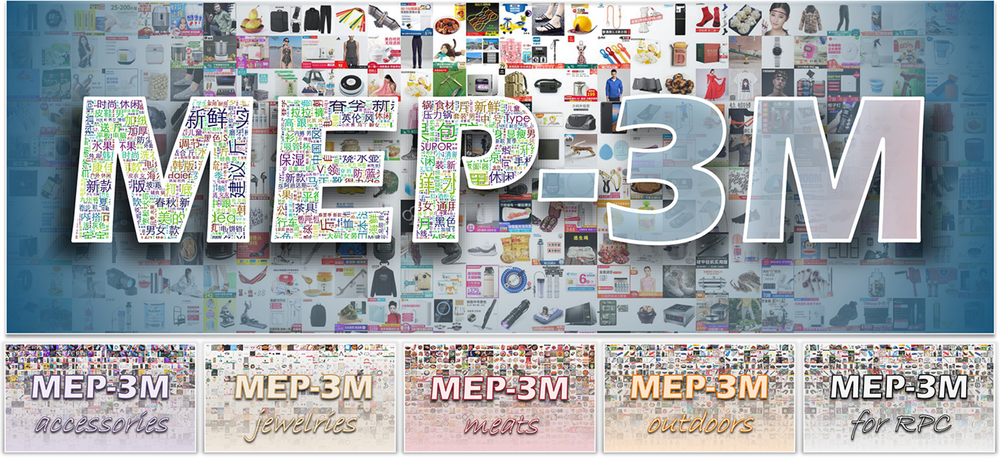

# MEP-3M: A Large-scale Multi-modal E-Commerce Products Dataset

> [Delong Chen](https://chendelong.world/), [Fan Liu](https://multimodality.group/), [Xiaoyu Du](https://bio.duxy.cc/), Ruizhuo Gao, Feng Xu.
> <br>
> **MEP-3M: A Large-scale Multi-modal E-Commerce Products Dataset**
> <br>
> IJCAI-21 Workshop on Long-Tailed Distribution Learning, 2021. [[paper](https://www.researchgate.net/publication/353946545_MEP-3M_A_Large-scale_Multi-modal_E-Commerce_Products_Dataset)] (Best Dataset Paper Award)
> <br>
> Pattern Recognition, Volume 140, Page 109519 (2023). [[doi](https://doi.org/10.1016/j.patcog.2023.109519)]



The MEP-3M consists of over **3 million** products and **599** fine-grained product categories. Each product is represented with an image-text pair and annotated with hierarchical labels. The data is collected from several Chinese online shopping websites. The text is in simplified Chinese. Key features of MEP-3M include:

- **Large-scale.** MEP-3M dataset consists of over 3 million product samples in total. Each sample consists of an image-text pair, resulting in 3,012,959 images and 156,069,329 characters. The entire dataset takes approximately 76GB of storage.  
- **Hierarchical-categorized.** Three levels of the label are given. There are 14 classes (first level), 599 sub-classes (second level), and 13 sub-classes have further sub-sub-classes (third level).
- **Multi-modal.** Each product has both image and Chinese label and title. 
- **Fine-grained.** There are a total of 599 sub-classes, and many of them are fine-grained (e.g., different types of fruit, meat, shoes, clothes, etc.).
- **Long-tailed.** MEP-3M is highly imbalanced. Some sub-classes in the dataset have more than 90k samples, while some classes have around 30 samples. 

## Download the Dataset 📂

The dataset consists of three parts: images, text annotations, and category metadata.

- **Images**: the images are stored in 599 `.rar` files (67GB in total) according to their sub-class label. The file names correspond to the sub-class ID.
    Image data is under preparation. Please email `fanliu@hhu.edu.cn` if you have any inquiries.
    <!-- The full images can be accessed through [Baidu Netdisk](https://pan.baidu.com/s/1LrH9a67yi_-hFFVEGjTAlw?pwd=3209) (passcode: 3209) or the [Huggingface Repo](https://huggingface.co/datasets/chendelong/MEP-3M). --> 

- **Text Annotations**: the text annotations are stored in a single `annotation.json` file (1.58GB), which can be downloaded through [Baidu Netdisk](https://pan.baidu.com/s/1NncYjzZ0JL_W4-kawTGd_g?pwd=3209 ) (passcode: 3209) or the [Huggingface Repo](https://huggingface.co/datasets/chendelong/MEP-3M). We include a small sample file [`annotations-1k.json`](./annotations-1k.json) in this repo. Each sample is represented as a dictionary, for example:

    ```json
    {
        "class_id": "7",
        "class_name": "母婴/玩具/童装",
        "sub_class_id": "1",
        "sub_class_name": "孕妈奶粉",
        "subsub_class_id": "FALSE",
        "subsub_class_name": "FALSE",
        "img_path": "Images/1/4.jpg",
        "img_resolution": [
            220,
            220,
            3
        ],
        "title": "【送试用装】伊利金领冠孕妇妈妈奶粉900g含DHA正品怀孕期孕中期产妇妈妈奶粉",
        "OCR": "新客买1送1 180克 盒装祈客送 6金领冠uu45鼾专 元试喝可防伪可积分"
    },
    ```

- **Category Metadata**: it provides class name - class ID mapping and the hierarchical information of the dataset. It is directly include in this github repo: [dataset_info.xlsx](./dataset_info.xlsx).

    | class_id | class_name          | sub_class_id↑ | sub_class_name | subsub_class_id | subsub_class_name |
    | -------- | ------------------- | ------------- | -------------- | --------------- | ----------------- |
    | 7        | 母婴/玩具/童装      | 1             | 孕妈奶粉       | FALSE           | FALSE             |
    | 7        | 母婴/玩具/童装      | 2             | 婴幼儿奶粉     | FALSE           | FALSE             |
    | 5        | 食品/酒水/生鲜/特产 | 3             | 饮料饮品       | FALSE           | FALSE             |
    | ...      | ...                 | ...           | ...            | ...             | ...               |
    | 5        | 食品/酒水/生鲜/特产 | 523           | 水果           | 652             | 菠萝/凤梨         |
    | 5        | 食品/酒水/生鲜/特产 | 523           | 水果           | 655             | 草莓              |
    | 5        | 食品/酒水/生鲜/特产 | 523           | 水果           | 643             | 车厘子/樱桃       |
    | ...      | ...                 | ...           | ...            | ...             | ...               |
    | 7        | 母婴/玩具/童装      | 597           | 儿童配饰       | FALSE           | FALSE             |
    | 7        | 母婴/玩具/童装      | 598           | 床品           | FALSE           | FALSE             |
    | 7        | 母婴/玩具/童装      | 599           | 防尿用品       | FALSE           | FALSE             |

## Term of Use🚨

By downloading or using the Dataset, as a Licensee I/we understand, acknowledge, and hereby agree to all the terms of use. This dataset is provided "as is" and without any warranty of any kind, express or implied. The authors and their affiliated institutions are not responsible for any errors or omissions in the dataset, or for the results obtained from the use of the dataset. **The dataset is intended for academic research purposes only, and not for any commercial or other purposes.** The users of the dataset agree to acknowledge the source of the dataset and cite the relevant papers in any publications or presentations that use the dataset. The users of the dataset also agree to respect the intellectual property rights of the original data owners.


## Citation🎈

If you use the MEP-3M dataset in your work, please cite it as:

```bibtex
@article{liu2023mep,
  author       = {Fan Liu and
                  Delong Chen and
                  Xiaoyu Du and
                  Ruizhuo Gao and
                  Feng Xu},
  title        = {{MEP-3M:} {A} large-scale multi-modal E-commerce product dataset},
  journal      = {Pattern Recognition},
  volume       = {140},
  pages        = {109519},
  year         = {2023},
  url          = {https://doi.org/10.1016/j.patcog.2023.109519},
  doi          = {10.1016/J.PATCOG.2023.109519},
}
```
